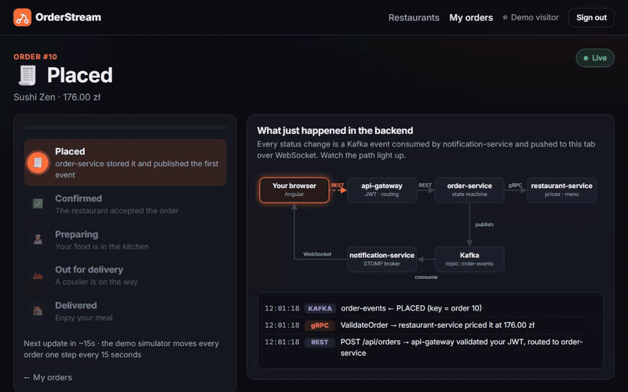
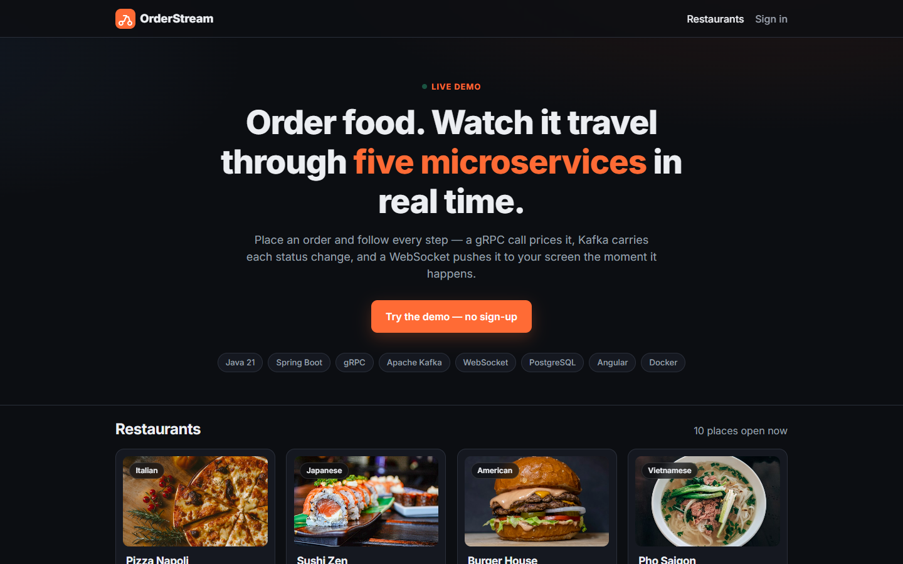
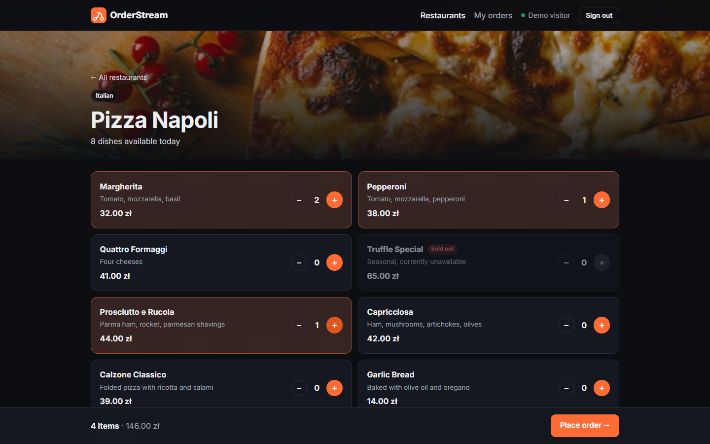
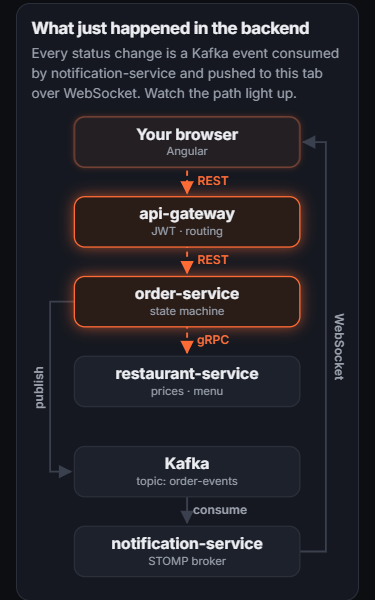

<div align="center">


# OrderStream

**Order food and watch it travel through five microservices in real time.**




</div>

## What you are looking at

A food-ordering system built as five Spring Boot microservices with an Angular frontend. It exists to show **synchronous gRPC** and **asynchronous Kafka** communication side by side, and to make them visible:

- **The price comes from gRPC.** When you order, `order-service` calls `restaurant-service` synchronously to validate the dishes and compute the total. The browser never sends a price.
- **Every status change is a Kafka event.** `order-service` publishes, `notification-service` consumes and pushes it to your tab over WebSocket — the tracking page measures that trip end to end, usually in 10–20 ms.
- **The backend map lights up as it happens.** A full-width diagram above the order draws the path each event took, so what is normally invisible in a demo is the main thing on screen. Tap any completed step to replay its path.
- **One click to try it.** "Try the demo" creates a throwaway account, so nobody has to fill in a form to see it work.
- **Works on a phone.** Every page is responsive; below tablet width the diagram switches to a vertical layout instead of shrinking.

| Browsing | Ordering | On a phone |
|---|---|---|
|  |  |  |

## Architecture

```
Angular (browser)
   │  REST + JWT                            ▲ WebSocket (live status)
   ▼                                        │
api-gateway :8080                    notification-service :8084
   │  routes + validates JWT                ▲
   ├──────────────┬──────────────┐          │ consumes
   ▼              ▼              ▼          │
auth-service  restaurant-   order-service ──┘ publishes
    :8081      service        :8083
               :8082 ◄── gRPC :9090 ── │        Kafka topic: order-events
                                       │
PostgreSQL: auth_db · restaurant_db · order_db
```

**Why two kinds of communication:**

| | Used for | Why |
|---|---|---|
| **gRPC** (sync) | order-service → restaurant-service, validating an order and getting its price | The customer is waiting for an answer. The call must complete before the order can be accepted. |
| **Kafka** (async) | order-service → notification-service, order status changes | Nobody is blocked. The event is a fact that already happened, and more consumers can be added later without touching the producer. |

## Tech stack

**Backend:** Java 21 · Spring Boot 3 · Spring Cloud Gateway · Spring Data JPA · Spring Kafka · Spring WebSocket (STOMP) · gRPC + Protocol Buffers · PostgreSQL 16 · JJWT
**Frontend:** Angular (standalone components, signals) · RxJS · @stomp/stompjs
**Testing:** JUnit 5 · Mockito · Testcontainers
**Infrastructure:** Docker · Docker Compose · GitHub Actions

## Running it

Requires Docker, JDK 21 and Node 22 or newer (Angular CLI 22 will not start on Node 20).

**Everything in containers:**

```bash
docker compose -f docker-compose.full.yml up --build -d
```

Then open <http://localhost:4300>.

**Working on the frontend only** (whole backend in Docker, Angular dev server on the host):

```bash
docker compose -f docker-compose.full.yml -f docker-compose.dev.yml up -d
cd frontend && npm start
```

Then open <http://localhost:4200>. The override file points the gateway's allowed CORS origin at `:4200` and keeps the containerised frontend out of the way, so the dev server owns that port and hot reload works against the real backend.

**For development** (infrastructure in Docker, services on the host):

```bash
docker compose up -d                              # Postgres + Kafka

cd auth-service        && ./mvnw spring-boot:run  # :8081
cd restaurant-service  && ./mvnw spring-boot:run  # :8082 + gRPC :9090
cd order-service       && ./mvnw spring-boot:run  # :8083
cd notification-service && ./mvnw spring-boot:run # :8084
cd api-gateway         && ./mvnw spring-boot:run  # :8080

cd frontend && npm start                          # :4200
```

The development compose file publishes PostgreSQL on host port **5433** (the container still listens on 5432), so it does not collide with a PostgreSQL already running on the machine. The datasource URLs in each service's `application.yml` point at `localhost:5433`; inside Docker everything uses `postgres:5432`.

## What to look at

- **The gRPC contract:** `restaurant-service/src/main/proto/restaurant.proto`
- **The sync call:** `order-service/.../grpc/RestaurantClient.java`
- **Publishing events:** `order-service/.../event/OrderEventPublisher.java`
- **Consuming and fanning out:** `notification-service/.../listener/OrderEventListener.java`
- **Gateway auth:** `api-gateway/.../security/JwtAuthFilter.java`
- **Integration test against real Postgres and Kafka:** `order-service/src/test/.../OrderFlowIntegrationTest.java`

Design decisions and their trade-offs are written up in [DLACZEGO.md](DLACZEGO.md) (in Polish).

## Deployment

- [DEPLOY_RAILWAY.md](DEPLOY_RAILWAY.md) — Vercel for the frontend, Railway for the services, Neon for Postgres and Redpanda for the Kafka API. Written to fit inside a $20/month usage budget.
- [DEPLOY.md](DEPLOY.md) — everything on one VPS with `docker compose`, behind nginx and certbot.


## Deliberate simplifications

This is a portfolio project, not a production system. The following are conscious trade-offs rather than oversights:

- **Auth is enforced at the gateway**, and downstream services trust the `X-User-Id` header it injects. In production the internal network must be genuinely private, or each service must validate the token itself.
- **`ddl-auto: update`** creates the schema. A production system would use Flyway or Liquibase with versioned migrations.
- **The JWT secret is in `application.yml`.** It belongs in a secrets manager.
- **`enableSimpleBroker`** is an in-memory STOMP broker, so WebSocket state is per-instance. Running more than one notification-service would require an external broker such as RabbitMQ.
- **Order progress is simulated** by a scheduled job, since there is no real kitchen or courier.
- **The proto file is duplicated** between the two services instead of living in a shared module. See DLACZEGO.md.
- **Demo accounts are throwaway.** "Try the demo" registers a random `demo-…@orderstream.dev` user so visitors never see each other's orders; nothing cleans them up.
